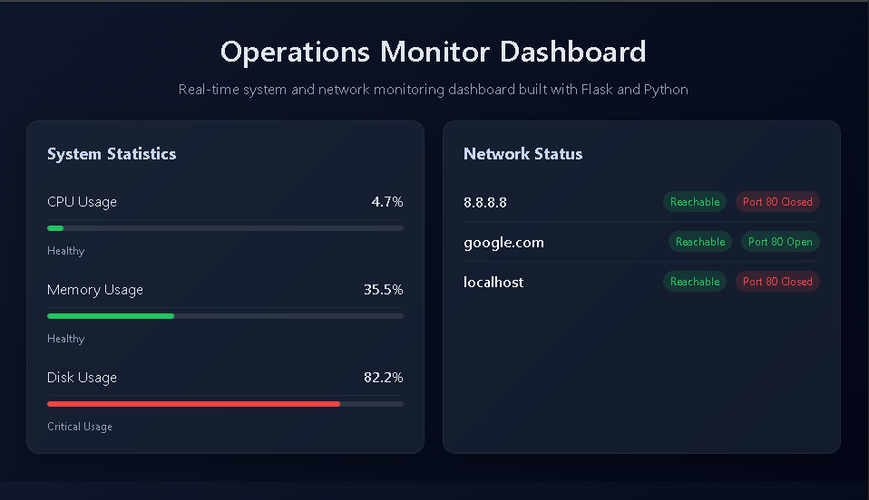

## Preview



# Operations Monitor Dashboard

A real-time system and network monitoring dashboard built with Flask and Python.

## Features

- Real-time CPU, memory, and disk monitoring  
- Network reachability checks (ping)  
- Port availability checks (port 80)  
- Dynamic status indicators (Healthy, Moderate, Critical)  
- Color-coded progress bars and alerts  
- Responsive dashboard UI  
- Logging of system and network data  

## Technologies Used

- Python  
- Flask  
- psutil  
- HTML / CSS (custom dashboard UI)  

## Project Structure

```bash
ops-monitor-dashboard/
│
├── app.py
├── config.py
├── requirements.txt
├── README.md
│
├── monitors/
│   ├── system_monitor.py
│   └── network_monitor.py
│
├── utils/
│   └── logger.py
│
├── templates/
│   └── dashboard.html
│
├── static/
│   └── style.css
│
├── logs/
│   └── app.log
│
└── screenshots/
    └── dashboard.png
```

## How to Run

1. Clone the repository

```bash
git clone https://github.com/SeanCah/ops-monitor-dashboard.git
cd ops-monitor-dashboard
```

2. Create a virtual enviroment

```bash
python -m venv venv
venv\Scripts\activate
```

3. Install dependencies

```bash
pip install -r requirements.txt
```

4. Run the application

```bash
python app.py
```

5. Open in browser

https://???????

## What This Demonstrates

- System monitoring using Python
- Network diagnostics and connectivity checks
- Backend + frontend integration with Flask
- Clean project structure and modular design
- Logging and operational awareness
- Ability to build tools relevant to IT operations and support roles

## Future Improvements

- Add authentication
- Add real-time auto-refresh with JavaScript
- Support monitoring multiple ports
- Export logs to CSV or dashboard
- Deploy to cloud environment

## Author

Sean Cahuasqui